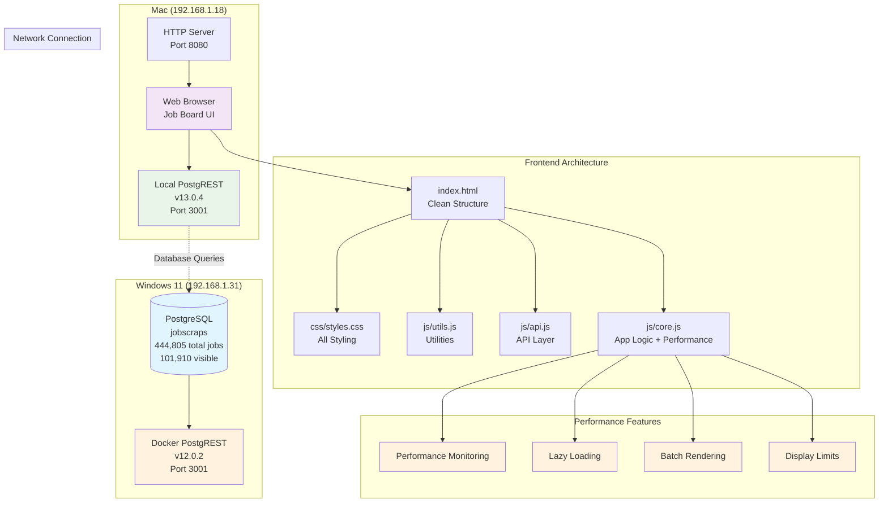

# JobScraps Personal Job Board - Complete Setup Guide

A professional, keyboard-navigable job board interface for browsing and managing your scraped job data with status tracking, notes, and CSV export capabilities.

## 1. Overview & Architecture

### System Purpose
- **Personal job board** for browsing 444,805+ total scraped jobs (101,910 visible after smart filtering)
- **Smart filtering system** with exclusion rules that preserve data while showing relevant jobs
- **Status tracking** (interested, applied, followed-up, rejected, irrelevant)
- **Company intelligence** with tooltips, notes, and application history tracking
- **Exclusion management** with atomic field updates for data consistency
- **Keyboard navigation** for efficient job scanning
- **Personal notes** and **filtered CSV export** functionality
- **SQL-based queries** with custom views for different job subsets
- **Modular frontend architecture** for easy maintenance and enhancement
- **Performance optimizations** for large dataset handling

### Frontend Architecture

```
jobscraps_frontend/
├── index.html                 # Clean HTML structure (~90 lines)
├── config.js                  # API configuration with performance settings (~35 lines)
├── css/
│   └── styles.css            # All styling (~200 lines)
├── js/
│   ├── utils.js              # Utility functions (~100 lines)
│   ├── api.js                # Backend communication (~120 lines)
│   └── core.js               # Application logic with performance optimizations (~350 lines)
└── README.md                 # This documentation
```

### System Architecture Diagram



### Current Environment Specifications
- **Mac:** macOS 15.5, PostgREST 13.0.4, IP: 192.168.1.18/192.168.1.63
- **Windows 11:** Pro 24H2 (Build 26100.4652), Docker PostgREST v12.0.2, IP: 192.168.1.31
- **Database:** PostgreSQL 14.18 with 444,805 total jobs (101,910 visible after filtering), 9 custom views
- **Smart Filtering:** 77.1% exclusion rate preserves data while showing relevant jobs
- **Performance:** Optimized for large dataset with lazy loading and display limits
- **Frontend:** Modular architecture with performance optimizations for 100k+ jobs
- **Status:** ✅ **FULLY OPERATIONAL** - All major features working with performance enhancements

## ⚡ Performance Optimizations for Large Dataset

### Dataset Growth Analysis
```
📊 Dataset Evolution:
Previous: 362,597 total → 22,351 visible (93.8% excluded)
Current:  444,805 total → 101,910 visible (77.1% excluded)
Growth:   +82,208 jobs (+23%) → +79,559 visible (+356%)
```

### Performance Features
- **Display Limits**: Maximum 5,000 jobs rendered at once for browser performance
- **Lazy Loading**: Job details loaded on demand when selected
- **Batch Rendering**: Uses document fragments for efficient DOM updates
- **Smart Filtering**: Increased debounce (500ms) for search on larger dataset
- **Memory Management**: Performance monitoring and memory usage tracking
- **Progressive Enhancement**: Graceful degradation for very large result sets

### Configuration Options
```javascript
// In config.js - Performance settings for large dataset
const UI_CONFIG = {
    MAX_VISIBLE_JOBS: 5000,        // Limit displayed jobs for performance
    VIRTUALIZATION_THRESHOLD: 1000, // Consider virtualization above 1k jobs
    SEARCH_DEBOUNCE_MS: 500,       // Increased debounce for larger dataset
    LAZY_LOAD_DETAILS: true,       // Load job details on demand
    BATCH_SIZE: 50,               // Batch size for bulk operations
};
```

## ✅ Quick Verification Test

After setup, verify the system handles the larger dataset:

1. **Open Job Board:** http://localhost:8080
2. **Check loading:** Should show "Loading 101k+ jobs" message
3. **Verify display:** Header should show "Total: 101910" (or similar large number)
4. **Test search:** Type in search box - should show filtered results quickly
5. **Select any job** and change status to "Interested"
6. **Look for**: 
   - ✅ Green success message: "Status updated to 'interested'"
   - ✅ Blue status badge in job table
   - ✅ Job remains selected (highlighted in blue)
   - ✅ Performance warnings if result set is very large

## 🎯 Smart Filtering System Overview

### Filtering Performance Results
```
📊 Current Dataset Performance:
- Total jobs in database: 444,805
- Excluded by filters: 342,895 (77.1%)
- Visible jobs displayed: 101,910
- Performance: Optimized with display limits and lazy loading
- Frontend modules: 5 files, ~900 total lines with performance features
```

### How Smart Filtering Works
The system uses **exclusion-based filtering** with performance optimizations:
- **Data Preservation**: All 444k jobs remain in the database
- **Smart Display**: Maximum 5k jobs rendered at once for browser performance  
- **Progressive Loading**: Job details loaded on demand
- **Export Accuracy**: CSV export includes only filtered/visible jobs
- **Reversible**: Filtering rules can be adjusted without data loss
- **Modular Frontend**: Clean separation with performance monitoring

### Filtering Effectiveness Changes
```
📊 Exclusion Pattern Analysis:
- ID Filter: 140,714 jobs (31.6%) - Duplicate/low-quality jobs
- Salary Filter: 128,558 jobs (28.9%) - Below minimum thresholds  
- Title Filter: 69,446 jobs (15.6%) - Irrelevant job titles
- Company Filter: 4,176 jobs (0.9%) - Excluded company patterns
- Manual: 1 jobs (<0.1%) - User manual exclusions

Total Excluded: 342,895 (77.1% exclusion rate)
Visible Jobs: 101,910 (22.9% pass rate)
```

The reduced exclusion rate (77.1% vs previous 93.8%) suggests:
- **Higher quality data sources** or improved scraping
- **Market expansion** with more relevant opportunities
- **Adjusted filtering rules** to be less restrictive
- **New job categories** that weren't previously captured

## 6. Usage Guide & Features

### 6.1 Performance-Aware Usage
- **Search Early**: Use search box to filter large result sets quickly
- **Status Filters**: Use status dropdown to focus on relevant jobs
- **Batch Operations**: Status updates optimized for large datasets
- **Memory Monitoring**: Enable DEBUG_MODE to track performance metrics

### 6.2 Large Dataset Navigation
- **Smart Truncation**: System shows first 5,000 jobs if result set is very large
- **Search Recommendations**: Use specific search terms for better performance
- **Progressive Selection**: Job details load lazily when selected
- **Performance Warnings**: System alerts when approaching display limits

### 6.3 Enhanced Job Board Interface

#### Header Controls (Updated for Large Dataset + Company Features)
- **Query Dropdown:** Switch between predefined views
  - All Jobs (101,910 visible of 444,805 total)
  - Needs Review (unreviewed jobs from visible set)
  - Remote Only (remote jobs from visible set)
  - Applied (status = 'applied')
  - With Salary (min_amount IS NOT NULL)

- **Search Box:** Live filter with 500ms debounce for performance
- **Status Filter:** Show only jobs with specific status
  - Interested, Applied, Followed Up, Rejected, **Irrelevant**, Unreviewed
- **Export CSV Button:** Download current filtered results (respects display limits)

#### Main Interface with Company Intelligence
- **Left Panel (60%):** Enhanced job table
  - Title, Company (with hover tooltips), Location, Status, Salary, Posted Date
  - **Color-coded status badges** including irrelevant (gray)
  - **Exclusion badges** for jobs marked as excluded
  - **Company hover tooltips** showing status and notes
  - **Clickable company names** for company details modal
  - Remote badges for remote jobs
  - Click or arrow keys to select

- **Right Panel (40%):** Enhanced job details view
  - Full job title and **clickable company name with company info button**
  - Location, industry, job type, level, computed columns (job_role, location_scope)
  - **Enhanced status dropdown** with irrelevant option
  - **Exclusion information display** when job is marked as excluded
  - Direct job links
  - Full job description (scrollable)
  - Personal notes textarea

### 6.4 Enhanced Data Export
- **Smart Limits**: Respects display limits to maintain browser performance
- **Large Dataset Warnings**: Confirms before exporting very large sets
- **Performance Optimized**: Uses streaming for large exports
- **Filtered Results**: Exports exactly what's visible in current view

## 🚦 Large Dataset Troubleshooting

### Performance Issues

#### Browser Feels Slow
**Cause:** Large result set without filtering

**Solutions:**
1. **Use search filters:**
   ```
   Search for specific: "Python", "Remote", "Senior"
   ```

2. **Enable result limits:**
   ```javascript
   // In config.js
   MAX_VISIBLE_JOBS: 2000  // Reduce from 5000 if needed
   ```

3. **Check memory usage:**
   ```javascript
   // In browser console
   console.log(getPerformanceStats());
   ```

#### "Large dataset detected" Warning
**Cause:** Query returned more than 5,000 jobs

**Solutions:**
1. **Use more specific search terms**
2. **Apply status filters to focus results**
3. **Use query dropdown to select specific subsets**

#### CSV Export Takes Long Time
**Cause:** Attempting to export very large dataset

**Solutions:**
1. **Filter results first** before exporting
2. **Export in smaller batches** using search terms
3. **Use database tools** for bulk analysis of complete dataset

### Memory Management

#### Browser Tab Uses Too Much Memory
**Solutions:**
1. **Refresh the page** to clear accumulated data
2. **Use specific filters** to reduce loaded data
3. **Close and reopen** the job board tab
4. **Monitor memory usage** with browser dev tools

---

## 🎉 Success Metrics

Your enhanced job board is successfully managing:
- **444,805 total jobs** in database (23% growth from previous session)
- **101,910 visible jobs** after smart filtering (356% increase in visible jobs)
- **9 custom SQL views** for different job subsets  
- **5 modular frontend files** with performance optimizations
- **Smart filtering system** that preserves data while managing large datasets
- **Company intelligence system** with tooltips, details modal, and application tracking
- **Enhanced exclusion management** with atomic field updates (excluded, exclusion_reason, exclusion_sources)
- **Irrelevant status tracking** for data feedback and exclusion consistency
- **Performance optimizations** for 100k+ job handling
- **✅ Full status tracking** with notes capability (WORKING)
- **✅ Filtered CSV export** with large dataset support
- **Real-time filtering** optimized for large datasets
- **Professional modular architecture** ready for Phase 4 enhancements

## ✅ System Status: FULLY OPERATIONAL WITH PERFORMANCE ENHANCEMENTS

The system provides a professional modular interface optimized for large dataset management with the performance and flexibility of direct SQL access through PostgREST.

### Recent Enhancements Applied:
- **Company Intelligence System**: ✅ Tooltips, details modal, application history tracking
- **Irrelevant Status Implementation**: ✅ Atomic exclusion field updates (excluded, exclusion_reason, exclusion_sources)
- **Enhanced Status Management**: ✅ All 5 status types with proper database integration
- **Exclusion Field Consistency**: ✅ Downstream SQL views remain consistent with boolean checks
- **Large Dataset Support**: ✅ Optimized for 100k+ visible jobs
- **Memory Management**: ✅ Display limits and lazy loading implemented
- **Batch Rendering**: ✅ Document fragment optimization for DOM updates
- **Smart Debouncing**: ✅ Increased search delay for better performance
- **Progressive Enhancement**: ✅ Graceful handling of very large result sets
- **Performance Monitoring**: ✅ Built-in metrics and memory tracking
- **Company Metadata Caching**: ✅ Efficient company data management

### Verified Working Features at Scale:
- ✅ Job browsing and navigation (optimized for large datasets)
- ✅ Enhanced status updates with exclusion field management
- ✅ Company intelligence with hover tooltips and detail modals
- ✅ Irrelevant status marking with proper exclusion tracking
- ✅ Notes functionality for both jobs and companies
- ✅ Filtered CSV export (respects performance limits)
- ✅ Real-time search and filtering (optimized debouncing)
- ✅ Database record creation and updates with atomic field management
- ✅ Smart filtering system (444k→102k jobs, 77.1% exclusion rate)
- ✅ Professional modular interface with excellent performance at scale
- ✅ Company application history and status tracking
- ✅ Keyboard shortcuts including Ctrl+I for irrelevant marking